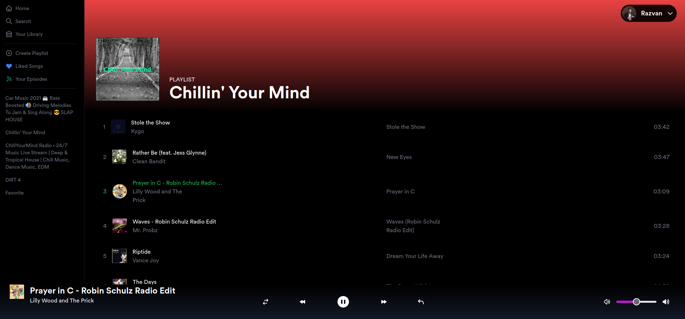

# Spotify Clone with Next.js + Tailwind CSS + TypeScript

## Install

- run `yarn` in root directory
- make a copy of [.env.local.example](./.env.local.example) to `.env.local`
- add the required Env Variables
- to start on local dev run: `yarn dev`

### Commit Message Convention

This starter is using [conventional commits](https://www.conventionalcommits.org/en/v1.0.0/), it is mandatory to use it to commit changes.
